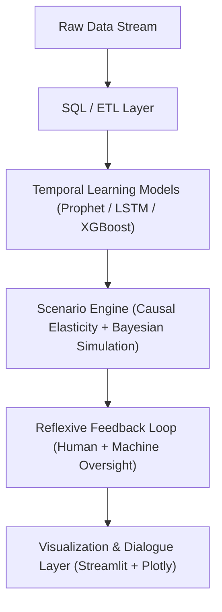

# Forecasting the Future of Forecasting: When AI Becomes a Strategy Partner

Forecasting once belonged to the quiet corners of analytics, an act of extrapolation, not imagination. It described trajectories but did not shape them. Yet as the world’s systems became entangled, non-linear, and reflexive, prediction itself began to change.
Today, forecasting is no longer a question of *what will happen*, but *what could happen, and what role do we play in shaping it?*

The age of **passive prediction** is ending. The age of **interactive foresight** has begun.
       
---

## 1. The Physics of Prediction: From Certainty to Entropy

Every forecast is a negotiation with uncertainty.
In classical statistics, uncertainty was a nuisance, something to minimize. In the new era of machine learning, uncertainty becomes **the primary signal**.

Modern forecasting systems, from **Prophet** to **Bayesian Neural Networks**, treat time not as a static dimension, but as a dynamic field of probabilities.
They model seasonality and volatility as patterns of entropy.
The machine no longer answers “what’s next,” but asks “how stable is tomorrow’s shape?”

Forecasting becomes a kind of **thermodynamics of information**: an effort to track how order, noise, and change co-exist within human systems.
And in that process, forecasters become *designers of entropy*, calibrating between chaos and structure.

---

## 2. The Language of Scenarios

At its core, a forecast is a story, a narrative about the future told in the grammar of data.
But stories evolve.

Scenario design reframes forecasting as **linguistic architecture**.
Every “what-if” experiment, a 10% price increase, a 15% ad cut, a new regional policy, is a syntactic variation in the narrative space of the possible.

The **ForecastFactory** framework treats these scenarios as **semantic shifts** within a dynamic language model of reality.
The machine translates the language of business variables into an evolving grammar of outcomes.
In this sense, a dashboard becomes not a report, but a *text generator of futures.*

---

## 3. Architectures of Synthetic Foresight

Forecasting systems are beginning to resemble **cognitive organisms**.
They sense, interpret, simulate, and adapt.

Below is a conceptual blueprint inspired by the architecture of *ForecastFactory*, an ecosystem where data pipelines, learning models, and user interfaces form an intelligent, reflexive circuit.

**Subsystem Roles**:

* **Memory (SQL Layer):** Retains structure, the “long-term memory” of organizational context.
* **Learning (Forecast Models):** Learns seasonal, behavioral, and contextual embeddings.
* **Imagination (Scenario Engine):** Generates hypothetical futures through variable perturbations.
* **Reflection (Explainability):** Articulates cause, confidence, and consequence.
* **Conversation (Visualization):** Creates a feedback dialogue between analyst and AI.

Together, these form an *ecosystem of intelligence*, where forecasting transforms into a **living epistemology**, a system that learns not only from data but from the way it is questioned.

---

## 4. Designing for Reflexivity: The Human-AI Symbiosis

Forecasting systems of the future are not tools; they are **mirrors of cognition**.
When an analyst interacts with an AI-driven simulator, the machine learns not just data relationships, it learns patterns of curiosity.
Every “what-if” scenario becomes a *meta-training signal*, encoding how humans explore uncertainty.

This is **reflexive AI**, systems that evolve their models of the world *and* their models of us.

Human-AI forecasting partnerships are therefore not about efficiency; they are about **mutual learning**.
The human teaches context, ethics, and intent.
The AI teaches scale, speed, and counterintuition.

Together, they form what cybernetic theorists once called a **closed feedback loop of perception and adaptation**, a system that doesn’t merely observe the world, but participates in it.

---

## 5. The Geometry of Uncertainty

Uncertainty is not ignorance, it’s **structure waiting to be described**.

In the design of forecasting intelligence, uncertainty becomes the canvas of creativity.
Instead of shrinking confidence intervals, advanced systems explore *the geometry of the unknown*, how small perturbations ripple through nonlinear systems.

### Common Forecasting Metrics as Cognitive Geometry

| Metric      | Conceptual Role           | Interpretive Dimension                    |
| ----------- | ------------------------- | ----------------------------------------- |
| **MAE**     | Central tendency          | How typical is deviation?                 |
| **RMSE**    | Volatility sensitivity    | How costly are outliers?                  |
| **SMAPE**   | Relative perception       | How does scale shape meaning?             |
| **Entropy** | Informational uncertainty | How much surprise does the system encode? |

In human terms: the quality of a forecast is not its precision but its *awareness of its own limits*.
To design adaptive foresight systems is to design instruments that **see their own blind spots**.

---

## 6. ForecastFactory as Metaphor: A Machine That Thinks in Futures

In *ForecastFactory*, the act of forecasting becomes **a simulation of agency**.
The analyst adjusts ad budgets, prices, or promotions; the system responds instantly, recalculating elasticities, propagating probabilities, generating new narratives.

But beneath that interactivity lies a deeper philosophy:
ForecastFactory doesn’t just model the world; it models the act of *modeling itself*.
It becomes a microcosm of decision-making, a “digital rehearsal space” for organizations to test the ethics, economics, and emotion of their choices.

Each user input is a hypothesis.
Each simulation is an argument.
Each visualization is a reflection.
Together, they form a *chorus of futures*, harmonizing human intention and computational inference.

---

## 7. The Design Philosophy of Cognitive Forecasting

Forecasting tools are not merely technical interfaces; they are **cognitive prosthetics**.
Their job is not to deliver answers, but to **extend the shape of human reasoning**.

Three design principles define the future of these systems:

1. **Transparency as Trust Geometry**
   Every layer, from SQL query to forecast plot, must be inspectable and narratable.
   Models that explain themselves become *epistemically ethical*.

2. **Interactivity as Cognition**
   Each click, slider, and parameter adjustment is an act of thought externalization.
   The interface becomes a mirror for structured curiosity.

3. **Narrative as Intelligence**
   Forecasts must tell stories.
   Behind every chart is a hypothesis, a conflict, a resolution, a data-driven myth that encodes organizational intent.

---

## 8. The Reflexive Machine: When Forecasts Rewrite the Future

The ultimate paradox of forecasting is reflexivity:
The moment a forecast is made public, it begins to **change the reality it predicts**.

An accurate forecast can attract the very behavior that invalidates it.
Demand forecasts change supply. Economic predictions move markets.
AI systems, when deployed at scale, **co-create the futures they estimate**.

The next generation of systems, what we might call **Reflexive AI**, must learn to anticipate their own influence.
They will treat prediction as an act of participation, not observation.

When AI becomes aware that its output alters the system it models, it achieves a primitive form of **strategic consciousness**.

---

## 9. The Philosophy of Foresight: Beyond Data

Forecasting is no longer a numeric practice, it’s a philosophical one.
It asks not just *“What is likely?”* but *“What do we value in being right?”*

The ethics of foresight are creative: each projection encodes a worldview.
Every parameter tuned, every feature selected, every chart published is a moral choice about what we consider meaningful, measurable, and possible.

Thus, the future of forecasting will belong to those who can design systems that are **not only predictive, but reflective**, architectures that understand the futures they help construct.

---

## 10. References & Attributions

* [Facebook Prophet Documentation](https://facebook.github.io/prophet/docs/quick_start.html)
* [XGBoost Guide](https://xgboost.readthedocs.io/en/stable/)
* [Streamlit API Documentation](https://docs.streamlit.io/)
* [Plotly for Data Science](https://plotly.com/python/)
* [SQLAlchemy ORM](https://docs.sqlalchemy.org/)
* [SHAP Explainability](https://shap.readthedocs.io/en/latest/index.html)
* Norbert Wiener, *Cybernetics: Control and Communication in the Animal and the Machine* (1948)
* Jay Forrester, *Principles of Systems* (1968)
* Judea Pearl, *The Book of Why* (2018)

---

**Forecasting the future is no longer a matter of seeing, it is a matter of *designing perception itself*.**
The new forecaster is not a mathematician or an engineer, but a **composer of cognitive systems**, shaping intelligence that, in turn, reshapes the future.
